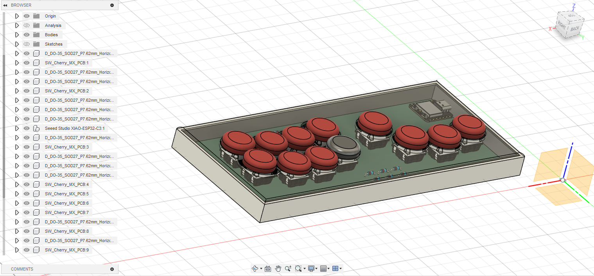
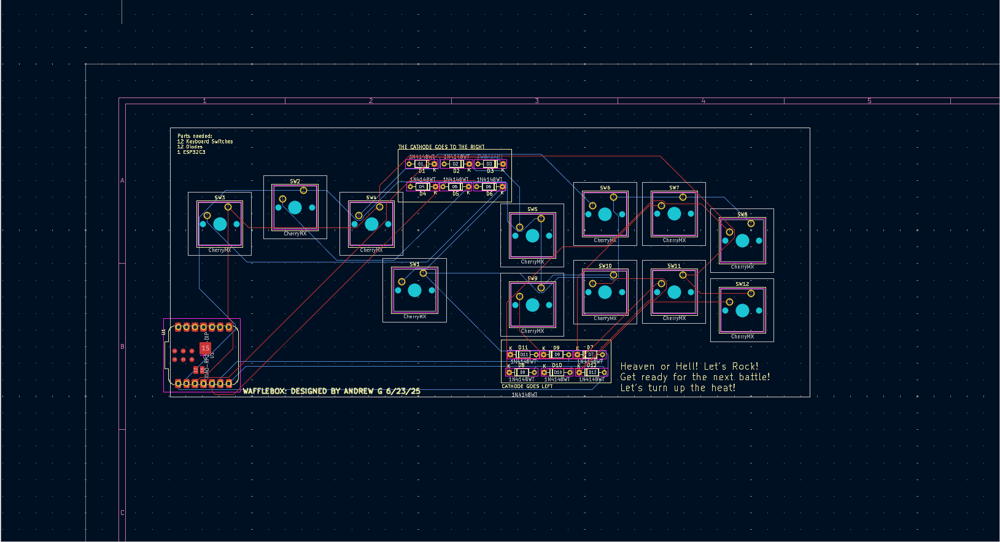
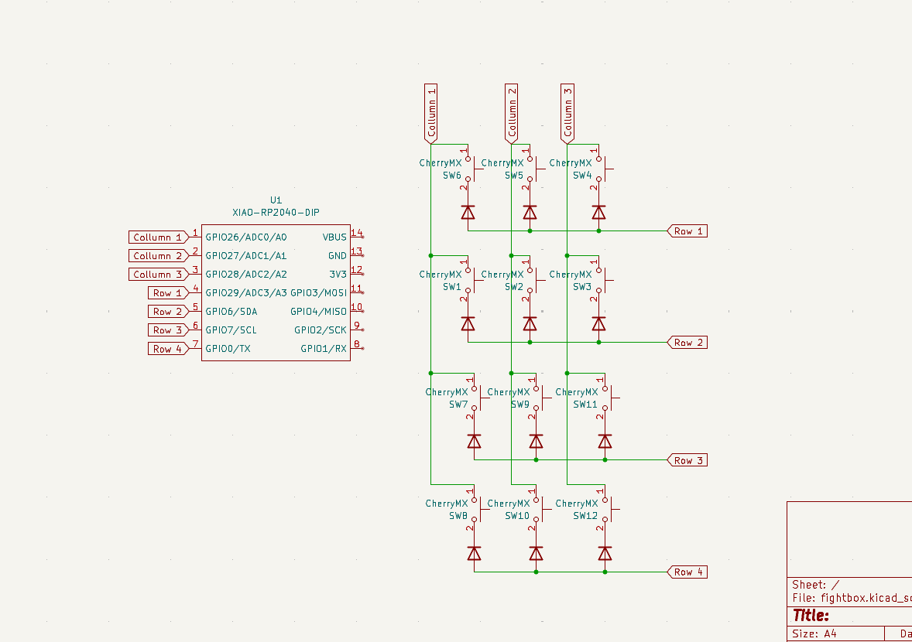
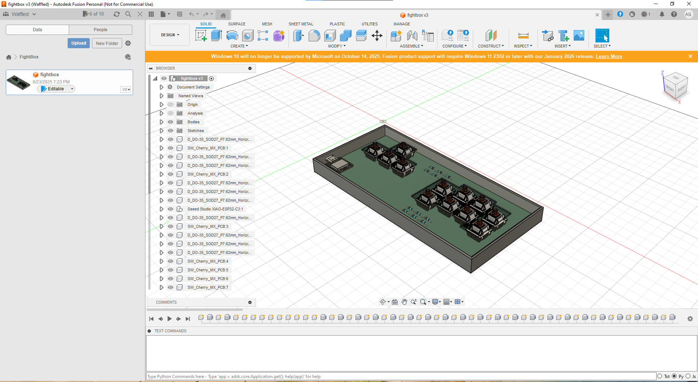

# FightBox

## Description
The FightBox is a flexible custom built FightBox for fighting games.

## Why I Made it
#### I've Always struggled with wrist pain growing up due to breaking both of them. When i started playing tekken 7 i realized that playing with a traditional FightStick/Controller would cause tons of pain in my wrists. I wanted to design something that was smaller but still use-able and wouldn't hurt my hands after long hours of use.
---

## Pictures

| FightBox Fully Built | PCB |
|--------------------|--------------|
|  |  |

| Schematic | Case  |
|-----------------|----------------|
|  |  |

---
## Bill of Materials (BOM)

| Part                         | Qty | Footprint                 |
|------------------------------|-----|---------------------------|
| 1N4148WT Diode               | 12  | D_DO-35_SOD27_P7.62mm     |
| Cherry MX Switch             | 12  | SW_Cherry_MX_1.00u_PCB    |
| XIAO Seeed ESP32             | 1   | MCU_Seeed_ESP32C3         |
| TicKnot Arcade Button Caps   | 12  | MX Keycap Compatible      |
